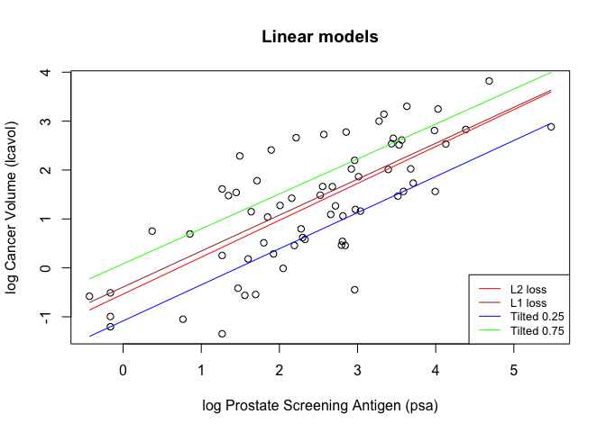
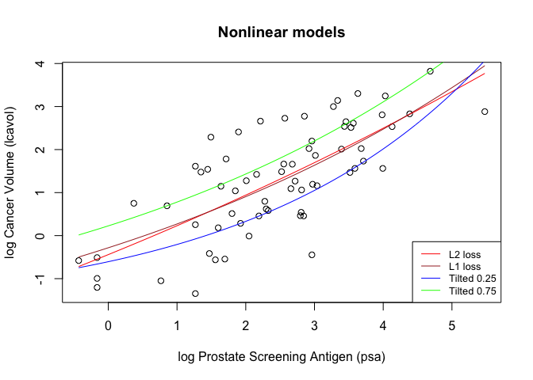

Using the RMarkdown/knitr/github mechanism, implement the following
tasks by extending the example R script (prostate-data-lin.R):

-   Write functions that implement the L1 loss and tilted absolute
    loss functions.

<!-- -->

    ## L2 loss function
    L2_loss <- function(y, yhat) (y-yhat)^2

    ## L1 loss function
    L1_loss <- function(y, yhat) abs(y-yhat)

    # tilted absoulte loss function
    t_loss <- function(y, yhat, tau) {
      tau * abs(y-yhat) * (+(y>yhat)) + (tau - 1) * (y-yhat) * (+(y<=yhat))}

-   Create a figure that shows lpsa (x-axis) versus lcavol (y-axis). Add
    and label (using the 'legend' function) the linear model predictors
    associated with L2 loss, L1 loss, and tilted absolute value loss for
    tau = 0.25 and 0.75.

<!-- -->

    ###############
    #   L2 loss   #
    ###############

    ## fit simple linear model using numerical optimization
    fit_lin_l2 <- function(y, x, beta_init = c(-0.51, 0.75)) {
      err <- function(beta)
        mean(L2_loss(y,  beta[1] + beta[2]*x))
      beta <- optim(par = beta_init, fn = err)
      return(beta)
    }

    ###############
    #   L1 loss   #
    ###############

    ## fit simple linear model using numerical optimization
    fit_lin_l1 <- function(y, x, beta_init = c(-0.51, 0.75)) {
      err <- function(beta)
        mean(L1_loss(y,  beta[1] + beta[2]*x))
      beta <- optim(par = beta_init, fn = err)
      return(beta)
    }

    ############################
    #   tilted absolute loss   #
    ############################

    ## fit simple linear model using numerical optimization
    fit_lin_t <- function(y, x, tau, beta_init = c(-0.51, 0.75)) {
      err <- function(beta)
        mean(t_loss(y,  beta[1] + beta[2]*x, tau))
      beta <- optim(par = beta_init, fn = err)
      return(beta)
    }

    ## make predictions from linear model
    predict_lin <- function(x, beta) beta[1] + beta[2]*x

    ## fit linear model
    lin_beta_l2 <- fit_lin_l2(y=prostate_train$lcavol,
                        x=prostate_train$lpsa)

    lin_beta_l1 <- fit_lin_l1(y=prostate_train$lcavol,
                        x=prostate_train$lpsa)

    lin_beta_t_0.25 <- fit_lin_t(y=prostate_train$lcavol,
                        x=prostate_train$lpsa,tau=0.25)

    lin_beta_t_0.75 <- fit_lin_t(y=prostate_train$lcavol,
                        x=prostate_train$lpsa,tau=0.75)

    ## compute predictions for a grid of inputs
    x_grid <- seq(min(prostate_train$lpsa),
                  max(prostate_train$lpsa),
                  length.out=100)

    ###############
    #   L2 loss   #
    ###############

    lin_pred_l2 <- predict_lin(x=x_grid, beta=lin_beta_l2$par)

    ###############
    #   L1 loss   #
    ###############

    lin_pred_l1 <- predict_lin(x=x_grid, beta=lin_beta_l1$par)

    ############################
    #   tilted absolute loss   #
    ############################

    lin_pred_t_0.25 <- predict_lin(x=x_grid, beta=lin_beta_t_0.25$par)

    lin_pred_t_0.75 <- predict_lin(x=x_grid, beta=lin_beta_t_0.75$par)

    ## plot data
    plot(prostate_train$lpsa, prostate_train$lcavol,
           xlab="log Prostate Screening Antigen (psa)",
           ylab="log Cancer Volume (lcavol)",main="Linear models")

    ## plot predictions
    lines(x=x_grid, y=lin_pred_l2,col="red")
    lines(x=x_grid, y=lin_pred_l1,col="brown")
    lines(x=x_grid, y=lin_pred_t_0.25,col="blue")
    lines(x=x_grid, y=lin_pred_t_0.75,col="green")
    legend("bottomright",legend=c("L2 loss","L1 loss","Tilted 0.25", "Tilted 0.75"),col=c("red","brown","blue","green"),cex=0.5,lty=1)

-   Write functions to fit and predict from a simple
    exponential (nonlinear) model with three parameters defined by
    'beta\[1\] + beta\[2\]*exp(-beta\[3\]*x)'. Hint: make copies of
    'fit\_lin' and 'predict\_lin' and modify them to fit the
    nonlinear model. Use c(-1.0, 0.0, -0.3) as 'beta\_init'.

<!-- -->

    ###############
    #   L2 loss   #
    ###############

    ## fit simple linear model using numerical optimization
    fit_nlin_l2 <- function(y, x, beta_init = c(-1.0, 0.0, -0.3)) {
      err <- function(beta)
        mean(L2_loss(y,  beta[1] + beta[2]*exp(-beta[3]*x)))
      beta <- optim(par = beta_init, fn = err)
      return(beta)
    }

    ###############
    #   L1 loss   #
    ###############

    ## fit simple linear model using numerical optimization
    fit_nlin_l1 <- function(y, x, beta_init = c(-1.0, 0.0, -0.3)) {
      err <- function(beta)
        mean(L1_loss(y,  beta[1] + beta[2]*exp(-beta[3]*x)))
      beta <- optim(par = beta_init, fn = err)
      return(beta)
    }

    ############################
    #   tilted absolute loss   #
    ############################

    ## fit simple linear model using numerical optimization
    fit_nlin_t <- function(y, x, tau, beta_init = c(-1.0, 0.0, -0.3)) {
      err <- function(beta)
        mean(t_loss(y,  beta[1] + beta[2]*exp(-beta[3]*x), tau ))
      beta <- optim(par = beta_init, fn = err)
      return(beta)
    }

-   Create a figure that shows lpsa (x-axis) versus lcavol (y-axis). Add
    and label (using the 'legend' function) the nonlinear model
    predictors associated with L2 loss, L1 loss, and tilted absolute
    value loss for tau = 0.25 and 0.75.

<!-- -->

    ## make predictions from linear model
    predict_nlin <- function(x, beta) beta[1] + beta[2]*exp(-beta[3]*x)

    ## fit linear model
    nlin_beta_l2 <- fit_nlin_l2(y=prostate_train$lcavol,
                        x=prostate_train$lpsa)

    nlin_beta_l1 <- fit_nlin_l1(y=prostate_train$lcavol,
                        x=prostate_train$lpsa)

    nlin_beta_t_0.25 <- fit_nlin_t(y=prostate_train$lcavol,
                        x=prostate_train$lpsa,tau=0.25)

    nlin_beta_t_0.75 <- fit_nlin_t(y=prostate_train$lcavol,
                        x=prostate_train$lpsa,tau=0.75)

    ## compute predictions for a grid of inputs
    x_grid <- seq(min(prostate_train$lpsa),
                  max(prostate_train$lpsa),
                  length.out=100)

    ###############
    #   L2 loss   #
    ###############

    nlin_pred_l2 <- predict_nlin(x=x_grid, beta=nlin_beta_l2$par)

    ###############
    #   L1 loss   #
    ###############

    nlin_pred_l1 <- predict_nlin(x=x_grid, beta=nlin_beta_l1$par)

    ############################
    #   tilted absolute loss   #
    ############################

    nlin_pred_t_0.25 <- predict_nlin(x=x_grid, beta=nlin_beta_t_0.25$par)

    nlin_pred_t_0.75 <- predict_nlin(x=x_grid, beta=nlin_beta_t_0.75$par)

    ## plot data
    plot(prostate_train$lpsa, prostate_train$lcavol,
           xlab="log Prostate Screening Antigen (psa)",
           ylab="log Cancer Volume (lcavol)",main="Nonlinear models")

    ## plot predictions
    lines(x=x_grid, y=nlin_pred_l2,col="red")
    lines(x=x_grid, y=nlin_pred_l1,col="brown")
    lines(x=x_grid, y=nlin_pred_t_0.25,col="blue")
    lines(x=x_grid, y=nlin_pred_t_0.75,col="green")
    legend("bottomright",legend=c("L2 loss","L1 loss","Tilted 0.25", "Tilted 0.75"),col=c("red","brown","blue","green"),cex=0.5,lty=1)

