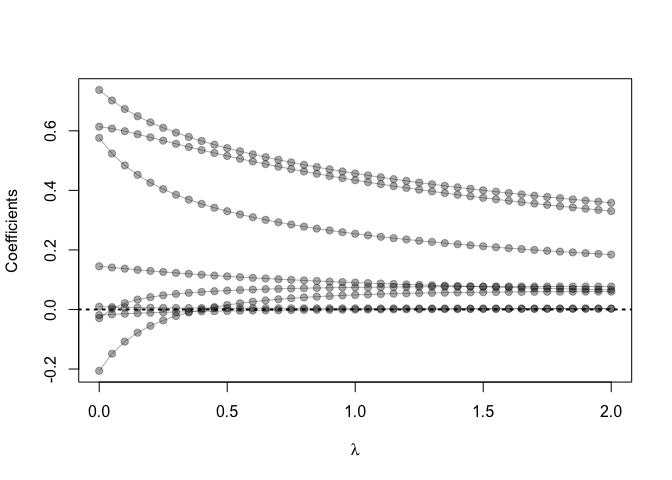
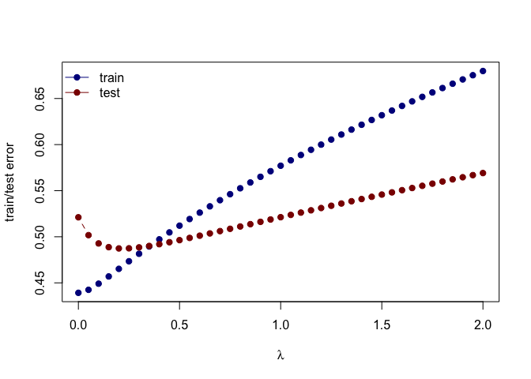

Using the RMarkdown/knitr/github mechanism, implement the following
tasks by extending the example R script (prostate-data-lin.R):

-   Use the prostate cancer data from the `ElemStatLearn` package for R.

<!-- -->

    library('ElemStatLearn')

    ## load prostate data
    data("prostate")

    ## subset to training examples
    prostate_train <- subset(prostate,train==T)
    prostate_test <- subset(prostate,train==F)

-   Use the `cor` function to reproduce the correlations listed in HTF
    Table 3.1 page 50

<!-- -->

    round(cor(prostate_train[,1:(ncol(prostate)-1)]),3)

    ##         lcavol lweight   age   lbph    svi    lcp gleason  pgg45  lpsa
    ## lcavol   1.000   0.300 0.286  0.063  0.593  0.692   0.426  0.483 0.733
    ## lweight  0.300   1.000 0.317  0.437  0.181  0.157   0.024  0.074 0.485
    ## age      0.286   0.317 1.000  0.287  0.129  0.173   0.366  0.276 0.228
    ## lbph     0.063   0.437 0.287  1.000 -0.139 -0.089   0.033 -0.030 0.263
    ## svi      0.593   0.181 0.129 -0.139  1.000  0.671   0.307  0.481 0.557
    ## lcp      0.692   0.157 0.173 -0.089  0.671  1.000   0.476  0.663 0.489
    ## gleason  0.426   0.024 0.366  0.033  0.307  0.476   1.000  0.757 0.342
    ## pgg45    0.483   0.074 0.276 -0.030  0.481  0.663   0.757  1.000 0.448
    ## lpsa     0.733   0.485 0.228  0.263  0.557  0.489   0.342  0.448 1.000

-   Treat `lpsa` as the outcome, and use all other variables in the data
    set as predictors

-   With the training subset, train a least-squares regression model
    with all predictors using the `lm` function (with the
    training subset)

<!-- -->

    ls <- lm(lpsa~.,data=prostate_train[,-ncol(prostate_train)])

-   Use the testing subset to compute the test error using the fitted
    least-squares regression model

The test error for each observation in the test set is stored in
`te.mse`.

    te.mse <- mean((prostate_test$lpsa - predict(ls,newdata=prostate_test[,c(-9,-10)]))^2)

Train a ridge regression model using the `glmnet` function, and tune the value of `lambda`
==========================================================================================

    library(glmnet)

    ## Loading required package: Matrix

    ## Loading required package: foreach

    ## Loaded glmnet 2.0-18

    ## first create an input matrix and output vector
    form  <- lpsa ~  0 + lcavol+ lweight + age + lbph + lcp + pgg45 + svi + gleason
    x_inp <- model.matrix(form, data=prostate_train)
    y_out <- prostate_train$lpsa
    fit <- glmnet(x=x_inp, y=y_out, lambda=seq(2, 0, -0.05),alpha=0)

    ## functions to compute testing/training error w/lm
    L2_loss <- function(y, yhat) (y-yhat)^2

    ## functions to compute testing/training error with glmnet
    error <- function(dat, fit, lam, form, loss=L2_loss) {
      x_inp <- model.matrix(form, data=dat)
      y_out <- dat$lpsa
      y_hat <- predict(fit, newx=x_inp, s=lam)  ## see predict.elnet
      mean(loss(y_out, y_hat))
    }

    ## set a range of lambda
    lambda.set <- seq(0,2,0.01)

    index <- which.min(sapply(lambda.set,function(x) error(prostate_test, fit, lam=x, form=form)))

    cat("The $\\lambda$ that minimizes the test error is",lambda.set[index],".")

    ## The $\lambda$ that minimizes the test error is 0.21 .

Create a path diagram of the ridge regression analysis
======================================================

    ## plot path diagram
    plot(x=range(fit$lambda),
         y=range(as.matrix(fit$beta)),
         type='n',
         xlab=expression(lambda),
         ylab='Coefficients')
    for(i in 1:nrow(fit$beta)) {
      points(x=fit$lambda, y=fit$beta[i,], pch=19, col='#00000055')
      lines(x=fit$lambda, y=fit$beta[i,], col='#00000055')
    }
    abline(h=0, lty=3, lwd=2)

Create a figure that shows the training and test error associated with ridge regression as a function of `lambda`
=================================================================================================================

    ## compute training and testing errors as function of lambda
    err_train_1 <- sapply(fit$lambda, function(lam) 
      error(prostate_train, fit, lam, form))
    err_test_1 <- sapply(fit$lambda, function(lam) 
      error(prostate_test, fit, lam, form))

    ## plot test/train error
    plot(x=range(fit$lambda),
         y=range(c(err_train_1, err_test_1)),
         type='n',
         xlab=expression(lambda),
         ylab='train/test error')
    points(fit$lambda, err_train_1, pch=19, type='b', col='darkblue')
    points(fit$lambda, err_test_1, pch=19, type='b', col='darkred')
    legend('topleft', c('train','test'), lty=1, pch=19,
           col=c('darkblue','darkred'), bty='n')

